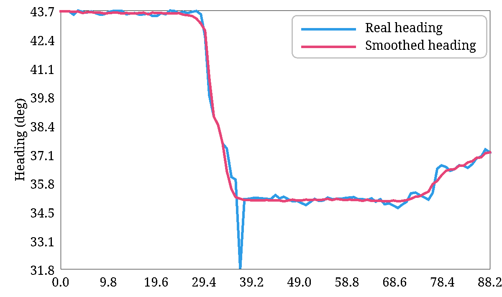
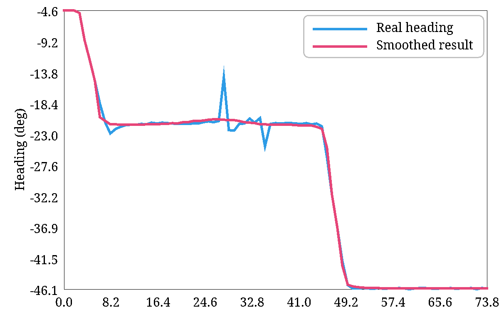
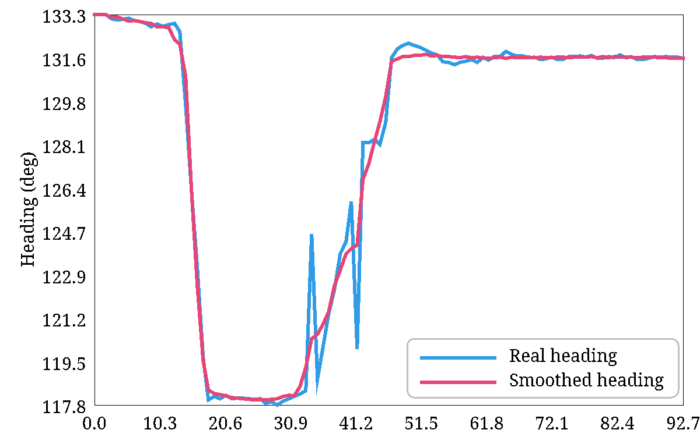
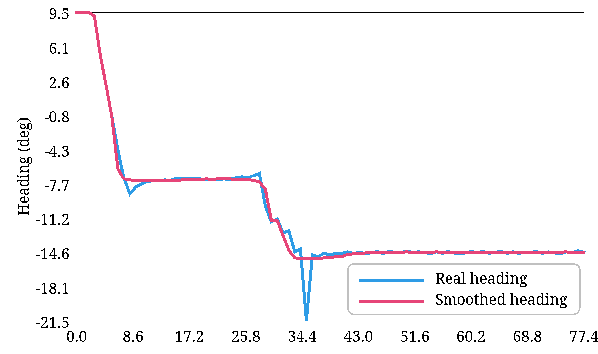
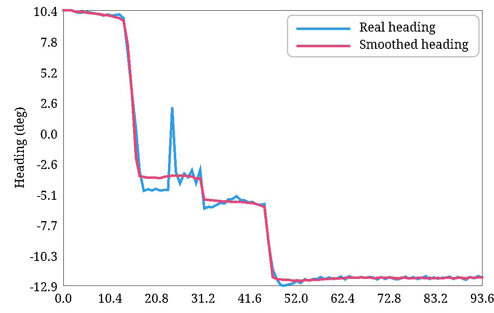

# Trajectory Heading Smoothing Tool

## Overview
This tool provides a simple and efficient method for smoothing trajectory heading data. It is especially useful in applications such as:
- Trajectory heading analysing
- Robotics navigation
- GPS tracking data preprocessing
- Motion analysis for vehicles or drones

By smoothing heading data, this tool helps reduce noise and improve trajectory visualization.

---

## Usage

### Prerequisites
Ensure you have the following environment set up before running the tool:
- **Java version**: 17
- **Maven version**: 3.6 or later

### Dependencies
This project relies on the following libraries, managed via Maven:

| Dependency                  | Version          | Description                              |
|-----------------------------|------------------|------------------------------------------|
| `deeplearning4j-core`       | 1.0.0-beta7      | Provides core deep learning functionality. |
| `nd4j-native`               | 1.0.0-beta7      | ND4J computation backend for deep learning. |
| `slf4j-simple`              | 1.7.30           | Logging framework for runtime information.|

---

## Running the Tool

### Running Predefined Cases
The following files can be executed directly:

MainCase1.java
MainCase2.java
MainCase3.java
MainCase4.java
MainCase5.java

### Using the Smoothing Function
You can use the tool to process custom heading data:
double[] smoothedHeadingDeg = Smoother.getSmoothed(headingDeg);

## Results

